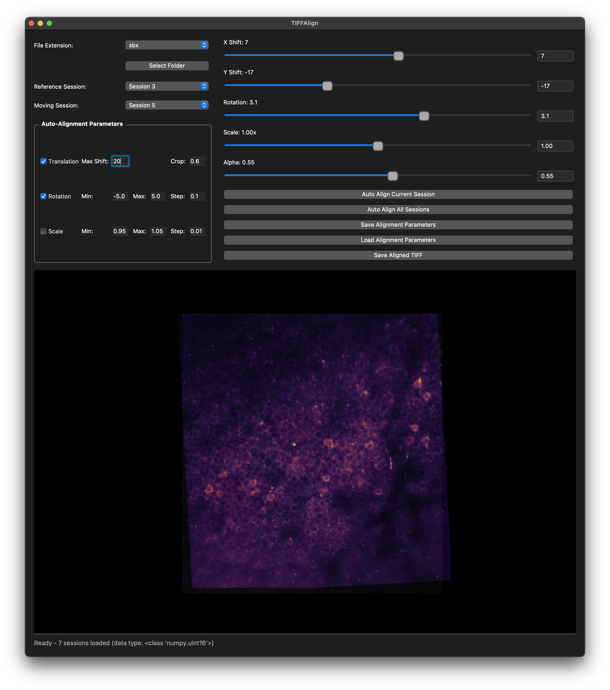

# TIFFAlign: Manual Alignment Across Imaging Sessions

This repository provides a **PyQt5-based GUI** for manually aligning one-photon / two-photon imaging sessions (`.sbx` or `.tiff` files). It allows interactive adjustment of **x/y shifts, rotation, and transparency**, and can save aligned data into a single TIFF stack.

Although many excellent automated motion correction algorithms exist, they are generally optimized for **within-session motion artifacts**. When working with **multiple sessions concatenated together**, shifts or rotations often occur between sessions. In these cases, we found that a manual **pre-alignment** step produces better results before applying automated motion correction. This little GUI was developed to streamline that process.



---

## Features

- Supports both `.sbx` and `.tiff` files
- Compute **mean frames** for the first 100 frames of each session (cached with pickle for faster reloads)
- Select any session as the **reference** session
- Interactive controls for:
  - X shift  
  - Y shift  
  - Rotation  
  - Transparency blending
- Save / load **alignment parameters**
- Export aligned sessions as a concatenated tiff file.
- Dark theme interface with **live overlay preview**


## Requirements and Installation

It is recommended to create a fresh environment to avoid conflicts with existing packages.  
That said, the required packages are fairly standard, so you may also be able to run this in an existing environment.

### Requirements
- Python 3.9+  
- PyQt5  
- numpy  
- scipy  
- matplotlib  
- tifffile  
- tqdm  

### 1. Clone this repository
```bash
git clone https://github.com/Bozhi-Wu/TIFFAlign.git
cd TIFFAlign
```

### 2. Create and activate a conda environment
```bash
conda create -n tiffalign python=3.11
conda activate tiffalign
```

### 3. Install dependencies
```bash
conda install pyqt=5 numpy=1.24 scipy=1.14 tifffile=2023 matplotlib tqdm -c conda-forge
```

---

## Usage

Run the GUI:

```bash
python TIFFAlign.py
```
1. Choose the **File Extension** (`sbx` or `tiff`).
2. Select a **Folder** containing `.sbx` or `.tif`/`.tiff` files. 
   - The files can exist in subfolders as `rglob` is used to find the files.
   - For the sessions to be concatenated in the correct order, please name the files so that they can be easily sorted with the python `sorted` function.
   - For `.sbx` files, the corresponding `.mat` metadata files are also required.
   - For the very first time, it will read and compute and mean frames for the first 100 frames of each session. These will be cached into `mean_frames.pkl` for future reload.
   - If there is an existing alignment parameter file `params_all.pkl` in the folder, it will be automatically loaded.
3. Pick a **Reference Session** and a **Moving Session**.
   - The reference session is shown in grayscale, while the moving session is overlaid using the *inferno* colormap.  
   - Use the alpha slider to adjust transparency and better visualize the alignment.  
   - When saving, the reference session remains unchanged; only the moving session is adjusted.  
4. Adjust alignment using the **Sliders**:
   - X Shift
   - Y Shift
   - Rotation
   - Alpha (transparency)
5. Save alignment parameters for later use.
6. Export the aligned file with **Save Aligned TIFF**.  
   - Files are read using `memmap` by default for efficiency.  
   - The output TIFF is written using the detected data type of the original files (for `.sbx` files, `uint16` is used).  
   - If `memmap` fails, the tool automatically falls back to `imread`, which loads the entire file into memory.  
   - ⚠️ Make sure your computer has enough available RAM when working with large files.  

---

## Outputs

- `params_all.pkl` – Stored alignment parameters.  
- `mean_frames.pkl` – Cached mean frames for faster reload.  
- `tiff_manual_aligned.tiff` – Exported aligned tiff file. 
